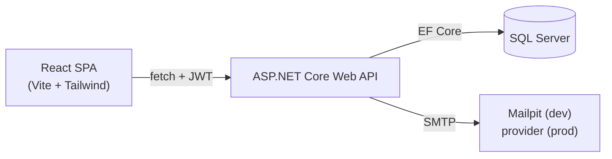

# TodoApp

A full-stack todo application built as a learning project — a **.NET 10 Web API**
with a **React + TypeScript** frontend, covering authentication, per-user data,
validation, structured logging, email, and integration testing.

> This is a personal project for learning modern full-stack development end to end.
> It is intentionally not "production-polished," but it aims to do the fundamentals
> the right way (secrets kept out of source, tests, clean error handling, etc.).

## Screenshots


## Features

- **Authentication** — register / log in with JWT bearer tokens (ASP.NET Core Identity)
- **Per-user data** — every todo is scoped to its owner; you only ever see your own
- **Todos** — create, edit, complete, archive (soft-hide), delete, and a show-archived toggle
- **Password reset** — forgot/reset flow with emailed reset links (no account enumeration)
- **Email** — SMTP via MailKit; a local Mailpit inbox in dev, real providers in prod
- **Validation** — data-annotation rules with clear, per-field error messages
- **Error handling** — unhandled exceptions return clean `ProblemDetails`, details logged server-side
- **Structured logging** — Serilog, one summary line per request
- **API docs** — OpenAPI document + Swagger UI with a JWT "Authorize" button
- **Tests** — xUnit integration tests over the real HTTP pipeline (25 passing)

## Tech stack

| Layer | Tech |
|-------|------|
| **Backend** | .NET 10, ASP.NET Core Web API, EF Core, SQL Server |
| **Auth** | ASP.NET Core Identity, JWT bearer tokens |
| **Frontend** | React, TypeScript, Vite, Tailwind CSS v4 |
| **Data/state** | TanStack Query (server state), React Router, React Context (auth) |
| **Email** | MailKit (SMTP), Mailpit (local inbox) |
| **Logging / docs** | Serilog, OpenAPI + Swagger UI |
| **Testing** | xUnit, WebApplicationFactory, EF Core InMemory |

## Architecture



In development the browser talks to the Vite dev server, which proxies `/api/*`
to the backend (sidestepping CORS and the dev HTTPS cert). In production the SPA
would call the API cross-origin, where the API's CORS policy applies.

---

## Getting started

### Prerequisites

- [.NET 10 SDK](https://dotnet.microsoft.com/download)
- [Node.js 20+](https://nodejs.org) (for the frontend)
- [Docker](https://www.docker.com) (for SQL Server and Mailpit), or a local SQL Server
- EF Core CLI tools: `dotnet tool install --global dotnet-ef`

### 1. Start the supporting containers

```bash
# SQL Server
docker run -e "ACCEPT_EULA=Y" -e "MSSQL_SA_PASSWORD=YourStrong@Passw0rd" \
  -p 1433:1433 -d --name todo-sqlserver mcr.microsoft.com/mssql/server:2022-latest

# Mailpit (catches reset emails; web inbox at http://localhost:8025)
docker run -d --name todo-mailpit -p 1025:1025 -p 8025:8025 axllent/mailpit
```

### 2. Configure backend secrets

Secrets are kept out of source control in
[.NET user secrets](https://learn.microsoft.com/aspnet/core/security/app-secrets):

```bash
cd src/TodoApp.Api

# Database connection (match the SA password above)
dotnet user-secrets set "ConnectionStrings:Default" \
  "Server=localhost,1433;Database=TodoApp;User Id=sa;Password=YourStrong@Passw0rd;TrustServerCertificate=True;Encrypt=True"

# JWT signing key (random)
dotnet user-secrets set "Jwt:Key" "$(openssl rand -base64 48)"
```

### 3. Create the database

```bash
dotnet ef database update --project src/TodoApp.Api
```

### 4. Run the backend

```bash
# From the repo root. Use the https profile so the frontend proxy can reach it.
dotnet run --project src/TodoApp.Api --launch-profile https
```

First time only, trust the dev certificate: `dotnet dev-certs https --trust`.

- API: `https://localhost:7243` (and `http://localhost:5263`)
- Swagger UI: `https://localhost:7243/swagger` (Development only)

### 5. Run the frontend

```bash
cd frontend
npm install
npm run dev
```

Open **http://localhost:5173**. The Vite dev server proxies `/api/*` to the
backend, so make sure the backend is running (step 4).

---

## Using the app

1. **Register** an account, then create and manage todos.
2. **Forgot password?** on the login page sends a reset email — open the Mailpit
   inbox at **http://localhost:8025** and click the link to reset.

## API endpoints

| Method | Route | Auth | Purpose |
|--------|-------|------|---------|
| POST | `/api/auth/register` | — | Create an account, returns a JWT |
| POST | `/api/auth/login` | — | Log in, returns a JWT |
| POST | `/api/auth/forgot-password` | — | Email a password-reset link (always returns 200) |
| POST | `/api/auth/reset-password` | — | Set a new password using the emailed token |
| GET | `/api/todos` | ✔ | List active todos (`?includeArchived=true` for all) |
| GET | `/api/todos/{id}` | ✔ | Get one todo |
| POST | `/api/todos` | ✔ | Create — body: `{ "title": "..." }` |
| PUT | `/api/todos/{id}` | ✔ | Edit a todo's title |
| DELETE | `/api/todos/{id}` | ✔ | Delete a todo |
| POST | `/api/todos/{id}/complete` | ✔ | Mark complete |
| POST | `/api/todos/{id}/archive` | ✔ | Archive (soft-hide) |

Protected endpoints need `Authorization: Bearer <token>`. In Swagger UI, click
**Authorize** and paste the raw token (no `Bearer ` prefix — Swagger adds it).

## Testing

```bash
dotnet test
```

xUnit integration tests exercise the real HTTP pipeline via `WebApplicationFactory`,
with an EF Core InMemory database and a capturing email sender — so they need no
running SQL Server or Mailpit.

## Project structure

```
src/TodoApp.Api/        The Web API
  Controllers/          HTTP endpoints (Todos, Auth)
  Models/               EF Core entities (Todo, ApplicationUser)
  Dtos/                 Request/response contracts
  Data/                 AppDbContext (IdentityDbContext)
  Auth/                 JWT, token/email services, Swagger bearer scheme
  Validation/           Custom validation attributes
  Migrations/           EF Core migrations
tests/TodoApp.Api.Tests/  Integration tests
frontend/               React + TypeScript + Tailwind SPA
  src/lib/              API client, JWT decoding
  src/context/          Auth context
  src/hooks/            TanStack Query hooks
  src/components/        Reusable UI (forms, todo item, route guard)
  src/pages/            Login, Register, Forgot/Reset, Todos
```

## Notes on production email

Email is config-driven, so going to production is a config change, not a code
change: point the `Email` settings at a real provider (SendGrid/Mailgun/SES/etc.),
enable `UseStartTls`, and put the provider credentials in secrets/env vars (never
in `appsettings.json`). The reset link points at `Frontend:BaseUrl`.

## Notes

- **Times** are stored and returned in **UTC**.
- **Archive vs. delete** are intentionally different: archive is a reversible
  soft-hide (`IsArchived`), delete is permanent.
